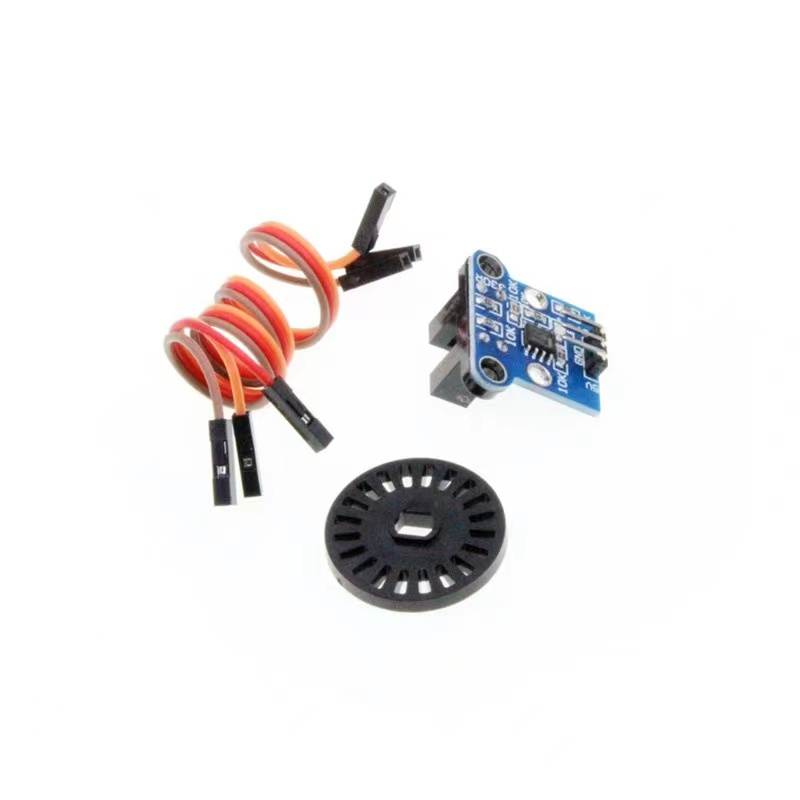

# hc-020k


HC020K光电测速模块 micropython 1.20

使用PICO RP2040 在micropython的1.20下测试通过，上传hc020k.py或者h20k.py 到你的PICO上 调用即可（两者选一个即可）。


## 接线
|PICO|HC020K_1|HC020K_2|
|-|-|-|
|VBUS|5V|5V|
|GND|GND|GND|
|GP0|OUT||
|GP1||OUT|

## hc020k.py
c.count 接收到的计数 (数据类型列表)  

c.RV 每秒钟转动的大小(数据类型列表)  


速度=c.RV[0]*轮子的周长


### 简单使用

```
import time
from hc020k import HC020k

c=HC020k(0)
while True:
   print("累计:",c.counts)
   print("转速:",c.RV)
   time.sleep(1)
#将GP0和HC020K测速模块的OUT引脚相连

累计: [0]
转速: [0.0]

```

### 需要安装多个测速模块

```
import time
from hc020k import HC020k

c=HC020k([0,1])
while True:
   print("累计:",c.counts)
   print("转速:",c.RV)
   time.sleep(1)
#将GP0、GP1分别和两个HC020K测速模块的OUT引脚相连

#累计: [0, 0]
#转速: [0.0, 0.0]

```

该类还适用于其他光电编码器,默认使用Timer，每秒10次即100ms进行一次计算，求出转速，可以根据自己的需求调整fps值

`c=HC020k(0,2)`

求全程平均速度，请使用c.counts[0]去计算


`qs=c.counts[0]/40 #圈数`

## h20k.py
和hc020k.py类似 ，但是该文件下每个HC020K使用独立的一个Timer，（hc020k.py使用一个Timer）对于 Timer使用有限制的项目且需要多个HC020K光电编码器的大佬可使用hc020k.py，一般无区别。
```
import time
from h20k import H20k
c=H20K(0)
     e=H20K(1)
     while True:
         print("累计:",c.count,e.count)
         print("转速:",c.RV,e.RV)
         time.sleep(1)
```
